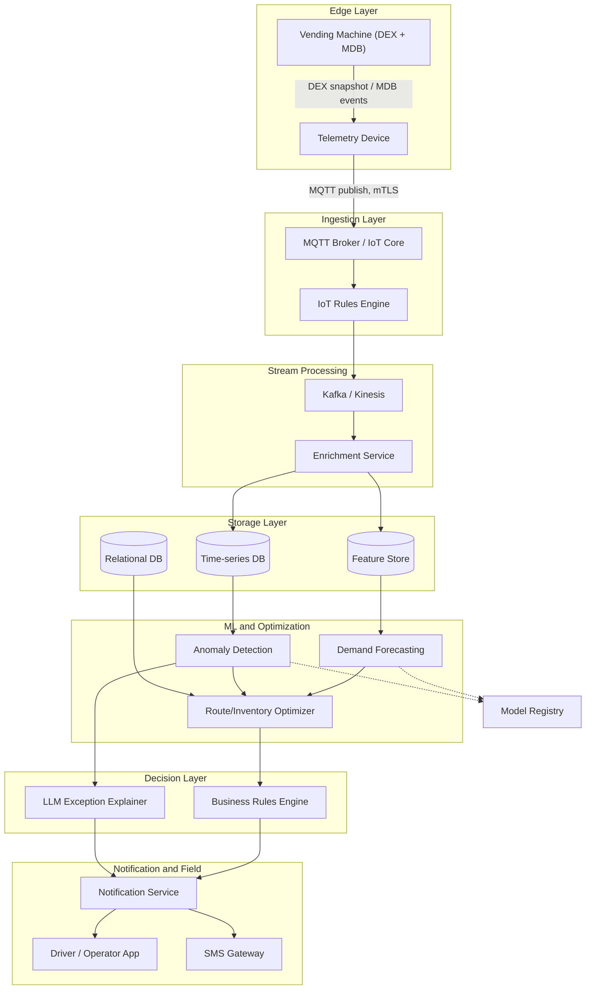
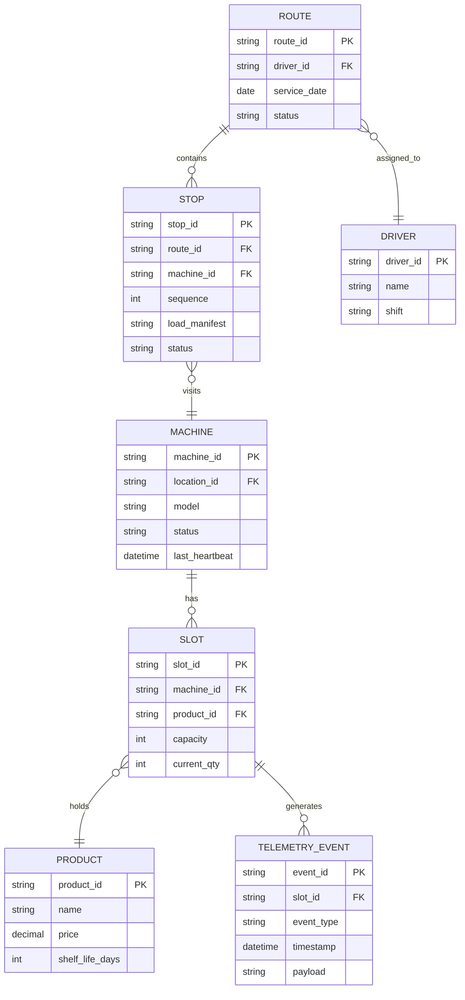
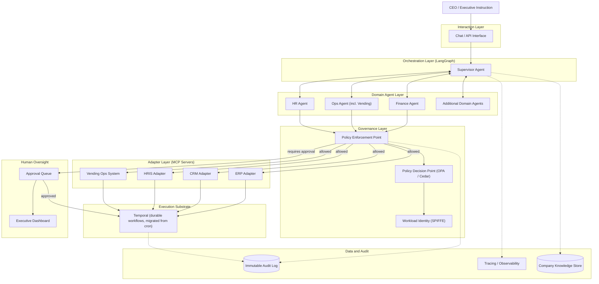
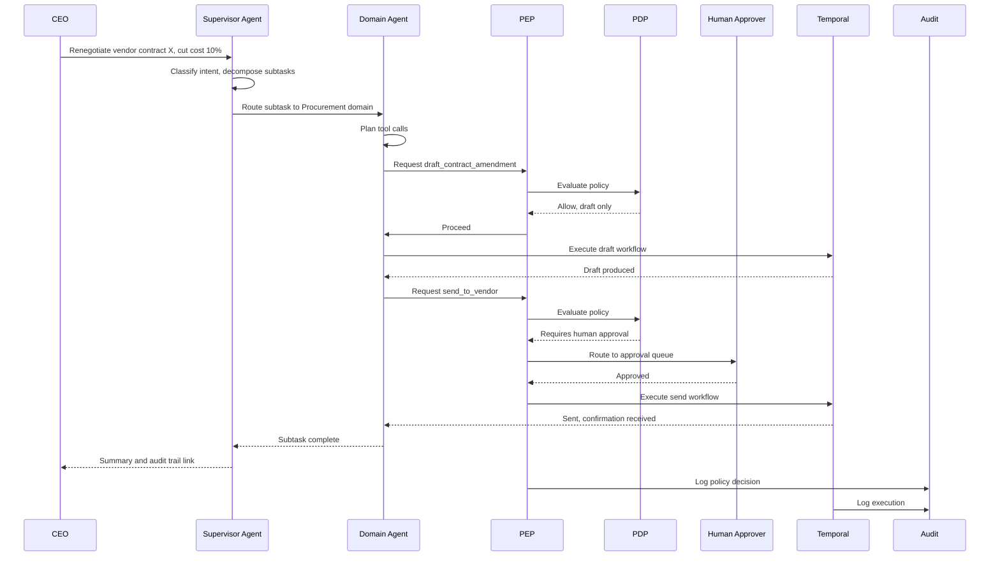
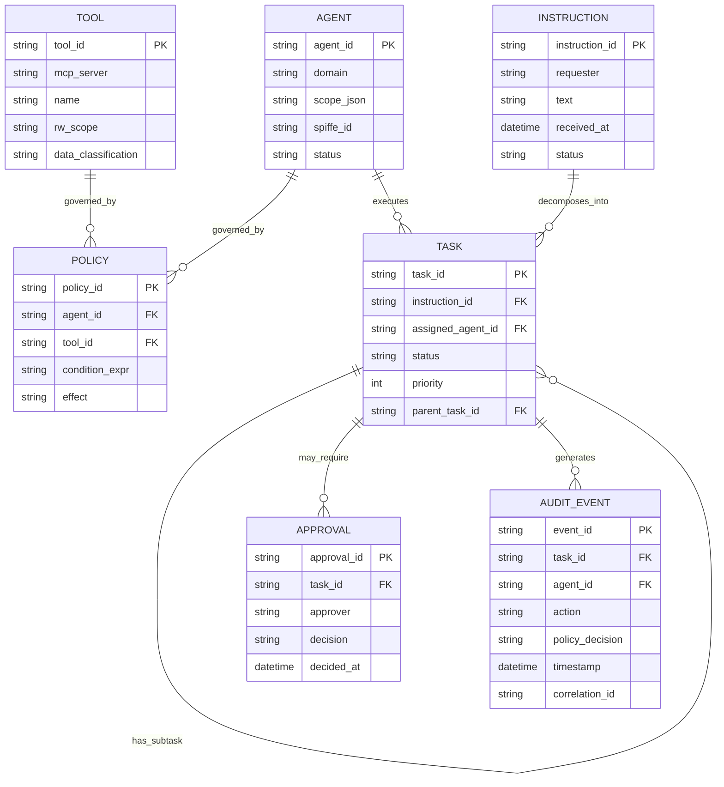
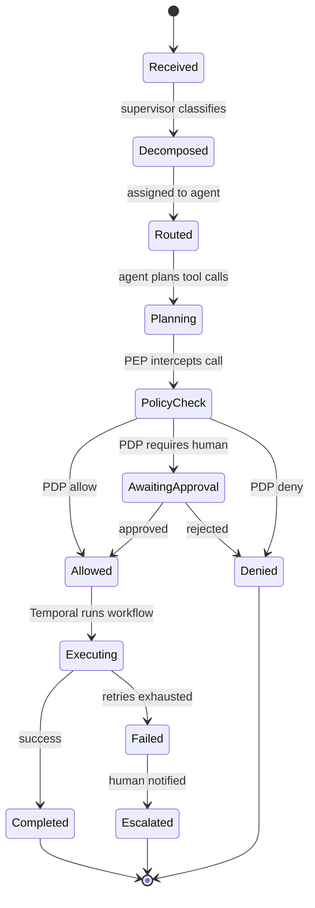

# Vending AI Optimization & Enterprise "COO Agent": Feasibility & Architecture

## TL;DR
- **Part 1 (vending telemetry AI) is highly feasible today** and is essentially a solved commercial category: DEX/MDB telemetry + demand forecasting + Vehicle/Inventory Routing optimization + anomaly detection is exactly what platforms like Cantaloupe (Seed), Parlevel, Nayax (MoMa), and Vendekin (vNetra) already do. Build it as classical ML + operations-research first; add LLM "agentic" reasoning only at the thin edges (exception explanation, dynamic replanning).
- **Part 2 (company-wide autonomous "COO agent") is aspirational and high-risk in its full form.** The orchestration plumbing (LangGraph supervisor pattern, MCP/A2A, Kagenti, OPA/Cedar policy gates, Temporal durable execution) is real and production-grade, but MIT's Project NANDA "The GenAI Divide: State of AI in Business 2025" (July 2025) found 95% of enterprise GenAI pilots deliver no measurable P&L impact. A CEO-to-all-operations autonomous agent should NOT be given broad authority; build it as a governed orchestrator over narrow, human-gated domain agents.
- **Recommended path: use Part 1 as the first well-scoped "domain agent" proving ground** that feeds the Part 2 architecture — proving telemetry ingestion, decision quality, human-in-the-loop dispatch, audit logging, and policy enforcement on a low-stakes domain before extending governance to financial/HR/legal actions.

## Key Findings

### Part 1 — Vending telemetry optimization
- **Telemetry protocols are standardized and mature.** DEX (Data Exchange / DEX-UCS, EVA-DTS standard) is a serial snapshot-polling protocol carrying aggregated sales/inventory/status/error data; MDB (Multi-Drop Bus/ICP, NAMA standard) is the master-slave bus connecting the vending machine controller to coin mechanisms, bill validators, and cashless readers, and is the only path for live per-transaction credit data. A telemetry device retrofits inside the machine, reads DEX/MDB, and relays over cellular/WiFi/BLE to the cloud.
- **The commercial category already automates this.** Cantaloupe Seed (with the Gimme Vending / Seed Key BLE DEX capture), Parlevel Systems (ParLevel One telemetry, dynamic routing, pre-kitting), Nayax (MoMa app, telemetry suite, BI), and Vendekin (vNetra platform) all provide predictive restocking, dynamic/route scheduling, cashless+telemetry analytics, and machine-fault alerts (jams, compressor failures, low stock, temperature).
- **Demand forecasting is a standard intermittent time-series problem.** Methods span classical (ARIMA/SARIMA/SARIMAX, exponential smoothing/Holt-Winters, Prophet) to ML (gradient-boosted trees/XGBoost, LSTM). Common exogenous features: seasonality, day-of-week, holidays, local events, weather, price, foot traffic. A real production deployment (Shandong New Beiyang, 5,000+ machines) forecasts product-terminal-day demand on a 14-day horizon using city, terminal scenario, product attributes, price, weather, holidays, and availability flags.
- **Route/delivery optimization is a well-studied OR problem.** This is the Inventory Routing Problem (IRP) / Vehicle Routing Problem (VRP). Google OR-Tools is the standard open-source solver. Vending-specific literature exists (Park & Yoo heuristics with Clarke-Wright savings algorithm; min-max replenishment policies for companies operating 100,000+ industrial vending machines; approximation algorithms for replenishment with fixed turnover times).
- **Predictive maintenance / anomaly detection is proven.** Hybrid Isolation Forest + LSTM autoencoder methods reach 0.95–0.98 accuracy in peer-reviewed studies; STL seasonal decomposition catches local anomalies (a spike during idle periods). Compressor/refrigeration faults can be predicted with weeks of lead time via current-signature and vibration analysis.
- **Production hardening is the hard part.** Handling missing/dropout data (imputation), avoiding alert fatigue (deduplication, correlation, dynamic thresholds, suppression rules), graceful degradation on connectivity loss, and validation of recommendations before trusting them.

### Part 2 — Enterprise multi-agent orchestration & governance
- **The orchestration frameworks are real and used together.** LangGraph provides stateful, graph-based multi-agent orchestration with persistence (checkpointers, Redis/Postgres), cycles, and human-in-the-loop checkpoints; the supervisor pattern (one orchestrator routing to specialist workers) is the most widely deployed. LangSmith provides tracing/observability/evaluation. LangChain is the base toolkit.
- **"openclaw" is a real, verifiable project.** OpenClaw is an open-source, self-hosted, model-agnostic autonomous-agent framework (originally "Clawdbot" by Peter Steinberger, renamed Jan 2026), notable for a proactive "heartbeat" daemon, an AgentSkill system with a ClawHub registry, and messaging-channel integrations. It became one of the fastest-growing open-source projects. It is a personal/operator-focused runtime, not an enterprise orchestration platform, and has attracted significant security scrutiny.
- **Kagenti is real** — an open-source, Kubernetes-native, framework-neutral platform (Apache 2.0) associated with IBM Research engineers, for deploying/securing/governing AI agents. Agents run as Kubernetes workloads over A2A; tools run as MCP servers; it uses SPIFFE workload identity, AgentCard CRDs, an MCP Gateway, and human-in-the-loop approval. (Note: distinct from "kagent" by Solo.io, a similarly-named Kubernetes agent runtime.)
- **IBM has a published governance stack.** watsonx.governance (GA Dec 5, 2023) provides lifecycle governance, policy management, auditability, agent monitoring/insights, and compliance accelerators aligned to the EU AI Act, ISO/IEC 42001, and NIST AI RMF, underpinned by IBM's AI Ethics Board and trust/transparency principles.
- **OWASP now covers agents explicitly.** The OWASP Top 10 for LLM Applications (2025/2026) includes LLM06 Excessive Agency; the OWASP Top 10 for Agentic Applications (ASI01–ASI10, Dec 2025) covers goal hijacking, tool misuse, memory/context poisoning, cascading failures, and rogue agents, with the architectural principle of "Least Agency."
- **Bell-LaPadula has credibly been proposed for AI agents.** Multiple recent papers apply BLP's "no read up, no write down" and Biba integrity/DIFC information-flow control to LLM agent data flows.
- **PDP/PEP is the settled pattern for gating agent actions.** Externalize authorization: a Policy Enforcement Point intercepts each tool call and consults a Policy Decision Point (Open Policy Agent/Rego or AWS Cedar). AWS has extended Cedar with "Dogwood" for temporal/sequence-aware agent policies; OpenID's AuthZEN working group is standardizing the PEP-PDP API.
- **MCP + A2A are the emerging interoperability standards.** MCP (Anthropic) standardizes agent-to-tool/data connections; A2A (Google, contributed to the Linux Foundation in June 2025) standardizes agent-to-agent collaboration. These map directly to the user's "universal ingestion systems and adapters" concept.
- **Reliability patterns are well-established.** Durable/idempotent execution engines (Temporal, plus Airflow/Dagster/Prefect) replace static cron with retriable, resumable, observable workflows; combine with retries, circuit breakers, human approval gates, audit logging, and staged/sandboxed rollout.

## Details

### Part 1: The vending telemetry optimization system

**Telemetry ingestion.** Each machine needs a telemetry device that reads DEX (aggregated snapshots per coil over a report period; EVA-DTS/DEX-UCS standard) and MDB (live per-transaction credit and peripheral status; NAMA standard) and transmits over cellular/WiFi (or BLE via a driver's device where connectivity is poor, as Cantaloupe's Seed Key does). Standard cloud pattern: devices publish MQTT to a managed broker (AWS IoT Core / Azure IoT Hub), an IoT rule routes to stream processing (Kinesis / Kafka / MSK) and to a time-series store (Amazon Timestream, InfluxDB, or TimescaleDB), with serverless compute (Lambda) for real-time alerting and SageMaker for model training/inference. AWS IoT Core supports direct rule actions to Timestream without custom code.

**Signals to ingest:** per-slot fill level / inventory depletion, sales velocity, cash/coin mechanism status and cash levels, bill validator/coin jam events, cashless reader status, refrigeration temperature (for cold units), door-open alarms, compressor current/vibration (if instrumented), connectivity heartbeat, power loss, and machine error codes.

**Demand forecasting.** Per-machine/per-slot forecasting is an intermittent-demand time-series problem. Start with strong classical baselines (SARIMAX, exponential smoothing/Holt-Winters, Prophet for irregular/holiday-driven series) and gradient-boosted trees (XGBoost) with engineered features; escalate to LSTM/deep models only if data volume justifies. Feature set: lagged sales, day-of-week/seasonality, holidays, local events, weather, price, and location type. The Shandong New Beiyang production system (5,000+ machines, 5,000 products, 60M+ transactions) demonstrates scheduled batch forecasting on a 14-day replenishment horizon using exactly these contextual features.

**Route & inventory optimization.** Model as an Inventory Routing Problem: decide which machines to visit, when, and how much to load, minimizing travel + stockout + holding cost, subject to turnover deadlines and truck capacity. Google OR-Tools is the standard solver for the routing (VRP) layer; the inventory-policy layer commonly uses (s,S) / min-max order-up-to policies. Published vending-specific work includes Park & Yoo's decoupled heuristic (integer LP for slot allocation + Clarke-Wright savings for routing) and min-max replenishment for a company running 100,000+ industrial vending machines. Pre-kitting (Parlevel) uses forecasts to pick exact quantities per machine before the driver departs.

**Predictive maintenance & anomaly detection.** Peer-reviewed hybrid methods combining Isolation Forest (a fast outlier detector) with an LSTM autoencoder (reconstruction-error verifier) are well documented: Priyanto, Hendry & Purnomo (2021 IEEE ICITech, DOI 10.1109/ICITech50181.2021.9590143) report the LSTM autoencoder reaching accuracy 0.95, precision 0.96, recall 0.99, F1 0.97; a hybrid AE+IF method on the CIC IoT-DIAD 2024 dataset (ETASR article 15288) reaches accuracy 0.98, outperforming either technique used independently. Edge deployments have hit >93% accuracy at <50ms inference. STL/RobustSTL seasonal-trend decomposition is fundamental for catching local anomalies (e.g., a spike during an idle period). For refrigeration, current-signature + vibration analysis can predict compressor failures with multi-week lead time; refrigerant/pressure sensors detect charge loss. Explainable models (SHAP/LIME) matter for operator trust.

**Production hardening (the real differentiator):**
- *Bad/missing sensor data:* Missing data from sensor failures, transmission errors, and maintenance is a documented, serious challenge. Align to a consistent time grid and impute (interpolation, forward/backward fill, mean/median → LSTM/GRU for harder cases); good seasonal imputation holds up even at 50% data loss.
- *Alert fatigue:* This is a signal-quality problem, not a volume problem. Use deduplication at ingestion (well-configured pipelines dedupe a large majority of alerts), grouping/correlation of related signals, dynamic (anomaly-based) thresholds instead of static ones, severity tiers, and per-site suppression rules. Suppress an alert unless multiple classifiers agree AND a threshold/rule is violated.
- *Connectivity loss:* Design for graceful degradation — buffer at the edge, treat heartbeat gaps distinctly from true faults, and fall back to schedule-based servicing when telemetry is stale. Cantaloupe's BLE Seed Key exemplifies capturing DEX where there's no cell coverage.
- *Validation before trust:* Shadow-mode the recommendations (run the optimizer's suggestions alongside human schedules and compare), measure stockout rate, service-visit reduction, and false-positive rate before letting the system drive dispatch.

**Notification/dispatch to field personnel.** The proven pattern: telemetry alert → routing/assignment logic → push to a driver/technician mobile app and/or SMS. Nayax's MoMa pushes low-stock alerts to drivers (even for nearby machines not on their route) and generates picklists. For SMS/voice, Twilio is the canonical provider; documented enterprise patterns include ServiceNow's Notify plugin (Business Rules auto-triggering SMS via the sendSMS() API) and field-service integrations (Salesforce Field Service, Dynamics Field Service) that dispatch technicians and notify customers "tech on the way." Modern FSM dispatch uses push-notification self-claim (workers claim jobs matching skill/location) and auto-assignment by availability/location/expertise.

**Where LLM "agentic" reasoning adds genuine value vs. hype.** Classical ML + OR is sufficient and superior for the core loop (forecast → optimize route → alert). LLM agents add value narrowly: (1) natural-language exception explanations to ops staff ("machine 412's compressor current is 15% above baseline; likely cooling fault, prioritize"); (2) dynamic replanning under changing constraints stated in natural language ("driver called out sick, re-balance today's routes"); (3) adjudicating conflicting priorities with human-readable rationale; (4) a conversational interface over the analytics. The deterministic optimizer should remain the source of truth; the LLM orchestrates, explains, and handles exceptions.

### Part 2: The "COO agent" enterprise orchestration platform

**Feasibility verdict.** The individual components are production-grade, but a fully autonomous CEO-to-all-operations agent is not a responsible near-term build. MIT's Project NANDA report "The GenAI Divide: State of AI in Business 2025" (July 2025; lead author Aditya Challapally, MIT Media Lab), based on 52 executive interviews, a 153-leader survey, and 300 public AI deployments, found that despite $30–40 billion in enterprise GenAI investment, 95% of organizations are getting zero return and just 5% of integrated AI pilots are extracting millions in value. Gartner (press release, Sydney, June 25, 2025) projects that over 40% of agentic AI projects will be canceled by the end of 2027, due to escalating costs, unclear business value or inadequate risk controls (analyst Anushree Verma), and estimates only about 130 of the thousands of agentic AI vendors are real. Failure causes are organizational and architectural (brittle workflows, no contextual learning, poor integration, weak governance), not model IQ. Notably, MIT found a build-vs-buy success spread of roughly 67% for buy/partner versus ~22–33% for internal builds — directly relevant to a build-vs-buy decision.

**Orchestration architecture.** Implement the hierarchy as a LangGraph supervisor pattern: a top-level supervisor decomposes the CEO's natural-language instruction, routes subtasks to specialized domain agents (each with its own tools/prompts), sequences and prioritizes, and returns results up the chain. Practical production lessons from practitioners: set temperature=0 on the supervisor for deterministic routing; forbid the supervisor from doing specialist work; give workers "if asked X, defer" guardrails; add a recursion/handoff guard (a real reported incident: a supervisor loop burned $180 in API costs over 47 iterations on one request); instrument everything in LangSmith from day one. CrewAI (hierarchical process) and AutoGen/Semantic Kernel (planner-based) are alternative idioms. Critically: most "multi-agent" systems should be a single well-prompted agent with good tools — reserve multi-agent for genuinely specialized, dynamically-coordinated work.

**Learning from existing cron jobs → adaptive execution.** The company's stored cron jobs are a valuable inventory of recurring operations. The right modernization is NOT to make an LLM fire them, but to migrate them onto a durable execution engine — Temporal (or Airflow/Dagster/Prefect) — which replaces cron with scheduled workflows that are retriable, resumable after crashes, idempotent, pausable, backfillable, and observable. Temporal explicitly positions Schedules as a direct replacement for cron and is used for durable AI agents. Layer adaptive/agentic decisioning on top of this reliable substrate incrementally, one workflow at a time, with the deterministic workflow remaining the backbone.

**Universal ingestion / adapters = MCP + A2A.** Map the user's "universal ingestion systems and adapters" to the two emerging standards: MCP (Anthropic) for agent-to-tool/data-source connections (the "how-to" for using a capability), and A2A for agent-to-agent delegation and collaboration. A2A launched April 2025 with 50+ partners and, per the Linux Foundation's one-year update, had grown to more than 150 supporting organizations (including Google, Microsoft, AWS, IBM, Salesforce, SAP, and ServiceNow), contributed to the Linux Foundation in June 2025 under Apache 2.0. These give agents safe, standardized access to many internal systems without bespoke integrations. Kagenti operationalizes this Kubernetes-natively (agents as A2A workloads, tools as MCP servers, MCP Gateway for routing).

**Governance and security guardrails (mandatory before broad authority):**
- *Policy enforcement (PDP/PEP).* Put a Policy Decision Point in front of every tool call. The model proposes; a deterministic engine (OPA/Rego or AWS Cedar) decides allow/deny with a reason, outside the model. Use defense in depth (agent runtime PEP + downstream service PEP), task-scoped capability tokens, and stream all decisions to a SIEM. AWS Cedar's "Dogwood" extension adds sequence-aware policies (rate limits, running totals, prior-action awareness).
- *Confidentiality via formal models.* Bell-LaPadula ("no read up, no write down") and Biba (integrity) / DIFC information-flow labels have been credibly proposed for agent data flows to prevent an agent from leaking higher-classification data to a lower-clearance recipient — directly relevant to a COO agent touching finance/HR/legal data.
- *OWASP mitigations.* Enforce "Least Agency": least-privilege tools, JIT ephemeral tokens, human-in-the-loop for consequential/irreversible actions, input/output validation, memory-poisoning defenses, and hard cost ceilings/circuit breakers (LLM10 Unbounded Consumption).
- *Identity.* Treat each agent as a first-class machine identity with an owner, bounded scope, and lifecycle (onboard, review, decommission/expire) — a shared requirement of NIST AI RMF and ISO/IEC 42001.
- *Standards alignment.* Align to NIST AI RMF (Govern/Map/Measure/Manage) and ISO/IEC 42001 (certifiable AI Management System); consider IBM watsonx.governance for agent inventory, monitoring, and compliance accelerators. Note the EU AI Act imposes obligations on high-risk uses (HR, credit, critical infrastructure).
- *Reliability patterns:* durable execution (Temporal), retries/timeouts, circuit breakers, human approval gates for high-stakes actions, comprehensive audit logging, and staged/sandboxed rollout.

**"Won't break in production" guidance.** Anthropic's "Building Effective Agents" (Erik Schluntz & Barry Zhang, Dec 2024) counsels finding the simplest solution possible and only increasing complexity when needed — which might mean not building agentic systems at all, since agents trade latency/cost for flexibility. HumanLayer's "12-factor agents" codifies production principles (own your prompts/context, keep agents small, decouple execution, human-in-the-loop control points). Both point to the same conclusion: constrain scope, keep humans in the loop at decision points, and instrument heavily.

## Recommendations

**Stage 0 — Foundation (0–3 months).** Instrument the telemetry pipeline (MQTT → IoT Core/IoT Hub → stream → time-series store). Migrate existing cron jobs to a durable execution engine (Temporal) as-is — no AI yet — to gain retry/resume/observability. Stand up LangSmith-style observability and an audit-logging spine. Decision gate to proceed: telemetry from >90% of machines flowing reliably; cron jobs running durably with alerting on failure.

**Stage 1 — Part 1 as the first domain agent (3–9 months).** Build the vending optimization system with classical ML + OR-Tools: per-slot demand forecasting, IRP/VRP route optimization, and anomaly detection with alert-fatigue controls (dedup, correlation, dynamic thresholds, severity tiers, suppression). Run in **shadow mode** first — recommendations compared against human schedules, not acting. Add a thin LLM layer only for exception explanation and conversational queries. Wire dispatch notifications (mobile push + Twilio SMS) with human confirmation. Benchmarks to graduate to live: forecast accuracy beating the current static schedule, ≥15–25% projected reduction in service visits or stockouts, and a false-positive alert rate low enough that drivers trust alerts (track acknowledged-vs-dismissed ratio).

**Stage 2 — Governed orchestration scaffold (9–15 months).** Introduce the LangGraph supervisor over 2–3 narrow, low-stakes domain agents (vending ops being the first). Enforce the full governance stack: PDP/PEP (OPA or Cedar) on every tool call, per-agent machine identity, Least-Agency scoping, human approval gates for any irreversible/financial action, cost ceilings/circuit breakers, and audit logging. Align to NIST AI RMF + ISO/IEC 42001; evaluate watsonx.governance and/or Kagenti if on Kubernetes. Benchmarks: zero policy-bypass incidents in red-team testing; every agent action attributable and auditable; supervisor routing accuracy measured and acceptable.

**Stage 3 — Selective expansion (15+ months).** Only after Stages 1–2 prove reliability, extend to additional domains. **Never** grant the agent autonomous authority over high-stakes financial, HR, legal/compliance, or other irreversible actions — these remain human-approval-gated indefinitely; the agent prepares and recommends, a human authorizes. Confidentiality-sensitive domains get Bell-LaPadula/Biba-style information-flow labels. Prefer buy/partner over pure internal build where mature vendors exist (MIT data: ~67% vs ~22–33% success).

**Thresholds that would change the plan:** If shadow-mode forecasts don't beat the static baseline, stay classical and defer agents. If false-positive alerts stay high, do not enable autonomous dispatch. If red-team testing finds policy bypasses, do not expand agent authority. If agent orchestration costs exceed the value of automation, collapse back to a single well-prompted agent or deterministic workflows.

## System Design — High-Level & Low-Level Architecture

*Concrete, implementable architecture for both systems. HLD covers component boundaries, data flow, and non-functional targets; LLD covers APIs, schemas, policies, and failure handling. Diagrams are Mermaid — most Markdown viewers, including GitHub and VS Code, render these natively.*

### Part 1 — Vending Telemetry AI Platform

#### High-Level Design

**Architecture principle:** a layered pipeline where deterministic ML/optimization is the decision-making core, and the system degrades gracefully — falling back toward the current static schedule — rather than failing hard when any layer is unavailable.



**Non-functional requirements:**

| Attribute | Target | How it's achieved |
|---|---|---|
| Ingestion throughput | Scales linearly with fleet size | Kafka/Kinesis partitioned by machine_id; stateless consumers |
| Alert-to-notification latency | Under 2 minutes for critical anomalies | Stream (not batch-only) path for high-severity events |
| Ingestion availability | 99.9%+ | Multi-AZ broker; edge buffering during connectivity loss |
| Data loss tolerance | Near-zero for inventory-relevant events | At-least-once delivery with idempotent dedup keys |
| Forecast quality | Beats current static schedule before cutover | Shadow-mode comparison, gated rollout |
| False-positive alert rate | Low enough that drivers act on alerts | Correlation, dynamic thresholds, severity tiers |
| Horizontal scalability | Add machines without re-architecture | Stateless services, partitioned storage, containerized deploy |

**Deployment view:** cloud region(s) matched to operational geography; managed IoT ingress (AWS IoT Core / Azure IoT Hub) fronting a managed streaming service (MSK/Kinesis); containerized enrichment/ML/optimizer services scaled independently (Kubernetes or serverless); managed time-series store and managed ML platform (SageMaker/Vertex AI) for training and canary deployment; CI/CD with a staging environment mirroring production for shadow-mode validation before any model or optimizer change reaches drivers; edge devices support over-the-air firmware/config updates and local buffering.

#### Low-Level Design

**Edge telemetry device.** Reads DEX snapshots (per-coil sales/status counters) and MDB bus traffic (live coin/bill/cashless events). Publishes to `telemetry/{machine_id}/dex` and `telemetry/{machine_id}/status` topics over MQTT with QoS 1, authenticated via a per-device X.509 certificate (mTLS). Maintains a local ring buffer (e.g., 72 hours) so no data is lost during connectivity gaps; flushes oldest-first on reconnect with a `buffered=true` flag so downstream systems can distinguish real-time from backfilled events.

**Ingestion & stream processing.** Kafka/Kinesis topics partitioned by `machine_id` (keeps a machine's event order intact and enables independent horizontal scaling). A schema registry (Avro/Protobuf) enforces the telemetry event contract; malformed events go to a dead-letter topic rather than blocking the pipeline. The enrichment consumer joins each event with machine/location/product metadata from the relational store before writing to the time-series DB and feature store.

**Storage schema:**



**ML services — API contracts:**

```
POST /v1/forecast
Request:
{
  "machine_id": "VM-04821",
  "slot_id": "S12",
  "horizon_days": 14
}
Response:
{
  "machine_id": "VM-04821",
  "slot_id": "S12",
  "model_version": "demand-forecast-v3.2",
  "forecast": [
    { "date": "2026-08-26", "predicted_units": 6.2, "ci_low": 4.1, "ci_high": 8.4 }
  ]
}
```

```
POST /v1/anomaly/score
Request:
{
  "machine_id": "VM-04821",
  "window_start": "2026-08-25T00:00:00Z",
  "window_end": "2026-08-25T06:00:00Z",
  "signals": ["temperature", "compressor_current", "door_events"]
}
Response:
{
  "machine_id": "VM-04821",
  "anomaly_score": 0.83,
  "anomaly_type": "refrigeration_drift",
  "explanation": "Compressor current 15% above 30-day baseline; temperature trending up 0.4C/hr",
  "recommended_priority": "high"
}
```

**Optimization engine:**

```
POST /v1/optimize/route
Request:
{
  "service_date": "2026-08-26",
  "drivers": [{ "driver_id": "D-14", "shift_start": "08:00", "vehicle_capacity_units": 400 }],
  "stops_required": [
    { "machine_id": "VM-04821", "urgency_score": 0.91, "load_estimate": { "S12": 20, "S07": 15 } }
  ],
  "constraints": { "max_route_minutes": 300 }
}
Response:
{
  "routes": [
    { "driver_id": "D-14", "stops": [
      { "machine_id": "VM-04821", "sequence": 1, "eta": "08:45", "load_manifest": { "S12": 20, "S07": 15 } }
    ]}
  ],
  "unassigned": []
}
```

Re-optimization triggers on: a new high-urgency anomaly, a driver callout/shift change, or a route falling behind schedule by more than a configurable threshold.

**End-to-end sequence:**

```mermaid
sequenceDiagram
    participant VM as Vending Machine
    participant TD as Telemetry Device
    participant Ingest as Ingestion
    participant Stream as Stream Processor
    participant ML as Forecast/Anomaly Services
    participant Opt as Optimizer
    participant Notif as Notification Service
    participant Driver as Driver App

    VM->>TD: DEX snapshot, slot 12 low stock
    TD->>Ingest: Publish telemetry (MQTT, mTLS)
    Ingest->>Stream: Route event
    Stream->>ML: Enrich and score
    ML-->>Stream: anomaly=false, stockout in 18h
    Stream->>Opt: Trigger re-optimization
    Opt->>Opt: Solve VRP with updated constraints
    Opt->>Notif: New route and load manifest
    Notif->>Driver: Push notification, updated stop
    Driver-->>Notif: Acknowledge
    Driver->>VM: Restock on-site
    Driver->>Notif: Mark complete
    Notif->>Stream: Feedback event, actual vs predicted
```

**Failure modes & resilience:**

| Failure | Behavior |
|---|---|
| MQTT broker unreachable from device | Device buffers locally, retries with backoff, no loss up to buffer limit |
| ML forecasting service down | Optimizer falls back to last-known-good forecast or static par levels |
| Optimizer timeout/failure | Fallback heuristic (nearest-neighbor + urgency sort) keeps drivers moving |
| Notification delivery failure | Retry with backoff, escalate to secondary channel, dedup via idempotency key |
| Bad/missing sensor reading | Flagged and imputed; never silently treated as zero-demand |
| Model drift detected | Automatic alert to MLOps, canary rollback to previous model version |

**Security:** per-device mTLS certificates (rotated, revocable); service-to-service auth via short-lived OAuth2/JWT; least-privilege IAM roles per service; encryption at rest and in transit; raw DEX/MDB dumps retained in object storage for audit but access-controlled separately from operational reads.

### Part 2 — COO Agent Orchestration Platform

#### High-Level Design

**Architecture principle:** a governed orchestrator over narrow, human-gated domain agents — not a single autonomous agent with broad authority. Every tool call passes through policy enforcement; every consequential or irreversible action requires human approval until trust is earned domain-by-domain (see the Stage 2/3 rollout above).



**Non-functional requirements:**

| Attribute | Target | How it's achieved |
|---|---|---|
| Policy evaluation latency | Under 100ms p95 per tool call | Local PDP sidecar/cache per agent pod (OPA) |
| Audit completeness | 100% of tool calls and decisions logged | PEP logs before and after every call; fail-closed if audit write fails |
| Blast radius containment | Domain-scoped, least privilege | Per-agent MCP tool allowlist; no cross-domain tool access by default |
| Approval SLA | Defined per domain/risk tier | Approval queue with escalation timers, dashboard visibility |
| Cost containment | Hard ceiling per session/task | Supervisor-level token/step budget, circuit breaker on runaway loops |
| Recoverability | Resume without duplicate side effects after crash | Temporal durable execution, idempotency keys on all activities |
| Fail-safe default | Deny, not allow, on ambiguity or PDP outage | PEP fails closed when PDP is unreachable |

**Deployment view:** a Kubernetes cluster (Kagenti pattern) hosting agents as workloads, each with a SPIFFE/SPIRE workload identity; an MCP Gateway routing tool calls to per-system MCP servers; OPA/Cedar as a policy sidecar or service co-located with agents for low-latency evaluation; a Temporal cluster (self-hosted or Temporal Cloud) as the durable execution substrate replacing cron; Postgres/Redis backing LangGraph checkpointing; LangSmith or a self-hosted equivalent for tracing; a secrets manager (e.g., Vault) issuing short-lived, task-scoped credentials so agents never hold long-lived credentials; network policies enforcing zero-trust between agent pods, the gateway, and downstream adapters.

#### Low-Level Design

**Supervisor agent.** Runs at temperature 0 for deterministic routing. On receiving an instruction, it classifies intent and emits a structured decomposition rather than free text:

```json
{
  "domain": "procurement",
  "subtasks": [
    { "id": "t1", "description": "Draft amendment to Vendor X contract", "priority": 1 },
    { "id": "t2", "description": "Send draft for vendor review", "priority": 2, "depends_on": "t1" }
  ],
  "requires_approval": true
}
```

Guardrails: a hard recursion/hop ceiling and a per-task cost budget (a real reported production incident involved a supervisor loop costing $180 over 47 iterations on a single request); the supervisor is forbidden from calling domain tools directly — it only routes.

**Domain agent template.** Every domain agent (Finance, Ops/Vending, HR, ...) follows the same scaffold: a system prompt with explicit scope boundaries, an explicit tool allowlist (never "all tools"), a structured output schema, and an explicit escalation path back to the supervisor or to a human when a request falls outside its scope.

**MCP adapter layer.** Each internal system (ERP, CRM, HRIS, the Temporal-migrated cron jobs, the Part 1 vending ops system) is wrapped as an MCP server exposing a defined, minimal set of tools/resources, each tagged with a declared read/write scope and a data classification (see below) — never raw database access.

**Policy layer (PDP/PEP).** Example policy (Rego-style, OPA):

```
package agent.authz

default allow = false
default require_approval = false

allow {
  input.agent.domain == "finance"
  input.action == "initiate_payment"
  input.resource.amount < 5000
  input.context.dual_approval == true
}

require_approval {
  input.action == "initiate_payment"
  input.resource.amount >= 5000
}

deny_hard {
  input.agent.domain == "hr"
  input.action == "terminate_employee"
  not input.context.human_approved
}
```

Bell-LaPadula-style data classification, enforced at the MCP Gateway (no read up, no write down):

| Classification | Example data | Minimum agent clearance | Agent may write down? |
|---|---|---|---|
| PUBLIC | Marketing copy, public pricing | Any | Yes |
| INTERNAL | Vending telemetry, ops metrics | Standard | Yes, to PUBLIC |
| CONFIDENTIAL | Financial statements, contracts | Elevated, named domain agent | No — blocked at Gateway |
| RESTRICTED | HR/PII, legal-privileged, board materials | Named agent + human co-sign per access | No — blocked at Gateway |

**Execution substrate (Temporal).** Each business action is a Temporal Activity; each multi-step task is a Temporal Workflow. Activities are idempotent (safe to retry) and use deterministic idempotency keys derived from the task ID. What was a cron job becomes a Temporal Schedule (same cadence, now retriable/resumable/observable); an agent can additionally trigger an ad hoc Workflow execution outside the schedule when conditions warrant, without touching the underlying cron definition.

**Sequence — CEO instruction through policy gate and approval:**



**Data model:**



**Task lifecycle:**



**Identity & secrets.** Every agent is a first-class machine identity (SPIFFE/SPIRE), not a shared service account. Tool calls use just-in-time, task-scoped credentials issued by a secrets manager (e.g., Vault) with short TTLs; agents never hold standing credentials to downstream systems.

**Audit & observability.** Every PEP decision and every Temporal activity emits an event (`agent_id`, `action`, `inputs`, `policy_decision`, `timestamp`, `correlation_id`) to an immutable audit store. LangSmith (or equivalent) traces the full reasoning/tool-call chain per task. Alert on statistically anomalous agent behavior (sudden spike in tool-call volume, repeated denied actions) — this is the direct mitigation for OWASP's "Unbounded Consumption" and "Excessive Agency" risks.

**Failure modes & resilience:**

| Failure | Behavior |
|---|---|
| PDP (OPA/Cedar) unreachable | PEP fails closed — deny all actions, alert on-call |
| Agent crash mid-task | Temporal resumes from last durable checkpoint, no duplicate side effects |
| Runaway agent loop | Supervisor cost/iteration ceiling terminates run, logs incident, notifies owner |
| Model API outage | Circuit breaker trips, task queued/deferred rather than retried indefinitely |
| Approval queue backlog | Escalation timer routes to secondary approver after SLA breach |
| MCP adapter/downstream outage | PEP-level circuit breaker; task marked blocked, not silently dropped |

## Caveats
- **Vendor vs. neutral sourcing.** Many Part 1 capability claims (predictive restocking, route optimization, specific reduction percentages) come from vendor marketing (Cantaloupe, Parlevel, Nayax, Vendekin) or vendor-adjacent CMMS/anomaly sources. Method-credibility claims (hybrid IF+autoencoder accuracy, STL decomposition, imputation robustness) rest on stronger peer-reviewed/academic sources. Alert-fatigue reduction stats (>90% dedup, up to 99% via correlation) and predictive-maintenance detection rates (70–85% compressor) are vendor figures — treat as directional, not guaranteed.
- **"Nayax Marketplace" was not verified.** Confirmed Nayax products are Nayax Core, MoMa, VMS, Energy Core, and Retail Management Cloud. Nayax leads on payments+telemetry+alerting; Vendekin and Cantaloupe use stronger AI/ML "predictive restocking" and "route optimization" language. Nayax's ~$27M VMtecnologia acquisition figure is press-reported (FinTech Futures), not confirmed from Nayax's own release.
- **"openclaw" identification.** OpenClaw is a real, viral open-source agent framework, but it is a personal/operator-focused local runtime with documented security concerns — not an enterprise-grade orchestration/governance platform. If the user meant it as their orchestration backbone, that would be a mismatch; the enterprise stack should be LangGraph/Temporal/MCP/A2A + a policy engine, with Kagenti for Kubernetes-native governance. (Coincidentally, a widely-cited Cedar PDP/PEP demo was built as a fork of OpenClaw, which is why it appears in agent-authorization discussions.)
- **Forward-looking claims.** Gartner's 40%-cancellation projection and various "predictive algorithms will soon…" vendor statements are forecasts/marketing, not established fact.
- **The 95% failure statistic** comes from one MIT report and should be read in context (it measures P&L impact of pilots, and success correlates with buying over building and back-office over sales/marketing use cases) — directionally corroborated by McKinsey/BCG data but not a verdict that "AI doesn't work."
- **Rapidly moving space.** MCP, A2A, Kagenti, Cedar/Dogwood, and OWASP's agentic guidance are all evolving quickly; specific versions/capabilities should be re-verified at implementation time.
- **The system design above is a reference architecture**, not a finished spec — node counts, exact SLAs, and cloud-provider specifics should be tuned to actual fleet size, transaction volume, and existing company infrastructure before implementation.
